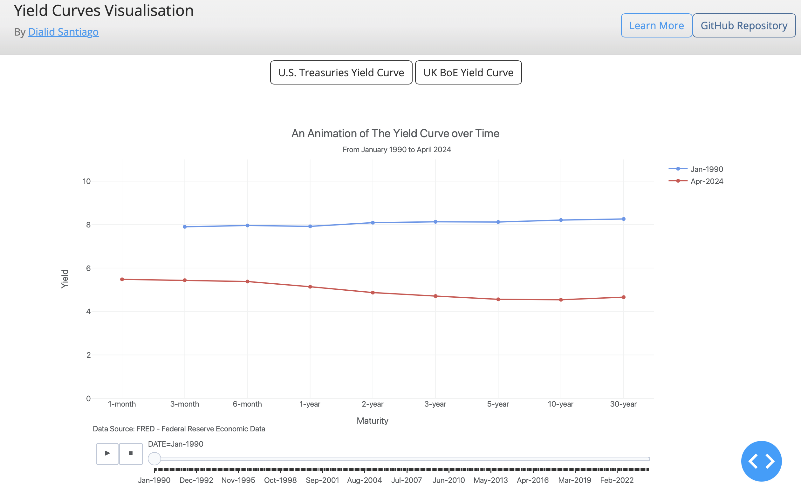
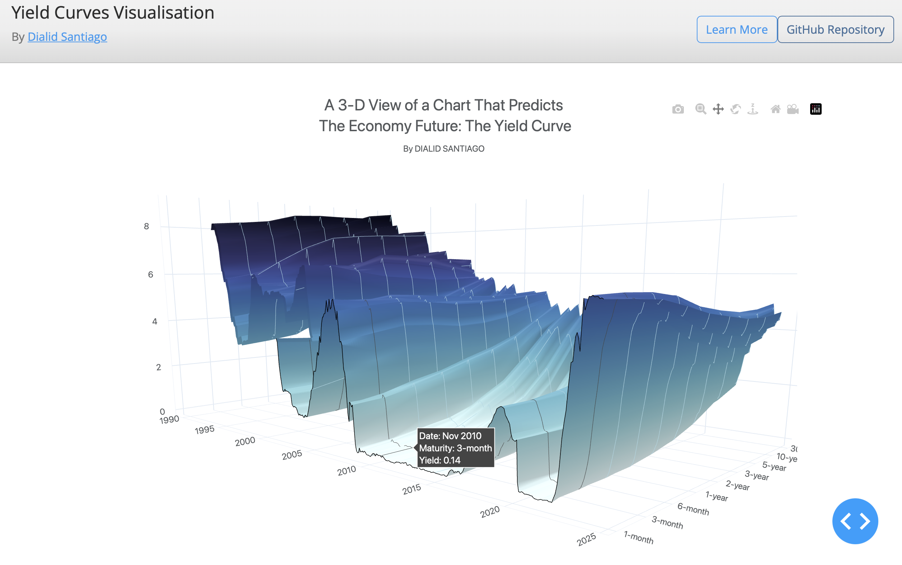

# Yield-Curves-Visual

This repository hosts the code for the dash app [Yield Curves Visualisations](https://yield-curves-visual.onrender.com).  This dash app contains interactive charts illustrating the risk-free Yield Curve 
for the US and the UK. It was written in Python using the graphing the
open source library [Plotly](https://plotly.com/python/).

If you like this project, please give it a star  ⭐️

---

---

---

## Yield Curve 101

In finance, the yield curve is a graph which depicts how the yields on debt 
instruments – such as bonds – vary as a function of their years 
remaining to maturity. 

[Ronald Melicher](https://www.colorado.edu/business/leeds-directory/faculty/ronald-melicher) and 
Merle Welshans have identified several characteristics 
of a properly constructed yield curve. It should be based on a set of 
securities which have differing lengths of time to maturity, and all 
yields should be calculated as of the same point in time. All securities 
measured in the yield curve should have similar credit ratings, to screen 
out the effect of yield differentials caused by credit risk. For this reason, 
many traders closely watch the yield curve for U.S. Treasury (Bank of England in the UK) debt securities, 
which are considered to be risk-free. 

## Visualisations
- The animation illustrates the evolution of the yield curve over time. It allows us to appreciate the different
shapes that it has taken, and how it compares with the present curve.

- The 3-D surfaces in this app follow the style from this article [A 3-D View of a Chart That Predicts
The Economic Future: The Yield Curve](https://www.nytimes.com/interactive/2015/03/19/upshot/3d-yield-curve-economic-growth.html) 
by The New York Times. 

- The Heatmap shows the yield curve evolution over time in two dimensions. It is worth
noting that the heatmap provides the same picture as  the 3-D surface when viewed from above. 

- Finally, the spread yield shows the difference between long and short term interest rates

## Data Source

- The data for the US Treasury Yield Curve comes from the [FRED Federal Reserve Economic Data](https://fred.stlouisfed.org). 
Yields on actively traded non-inflation-indexed issues adjusted to constant maturities. 
For further information regarding treasury constant maturity data, please refer to 
the [H.15 Statistical Release notes](https://www.federalreserve.gov/releases/h15/default.htm) and 
the [Treasury Yield Curve Methodology](https://home.treasury.gov/policy-issues/financing-the-government/interest-rate-statistics/treasury-yield-curve-methodology).

- The data for the UK Yield Curve comes from the [Bank of England](https://www.bankofengland.co.uk/statistics/yield-curves/terminology-and-concepts#:~:text=The%20nominal%20OIS%20yield%20curves,are%20available%20at%20monthly%20intervals.) 
official website. The government liability nominal yield curves are used.  These are derived from UK gilt prices and 
General Collateral (GC) repo rates. The methodology used to construct the yield curves is described in the 
Bank of England Quarterly Bulletin article by Anderson and Sleath (1999), and a detailed technical description can be 
found in their Bank of England Working Paper no.126, 'New estimates of the UK real and nominal yield curves'. 